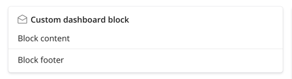
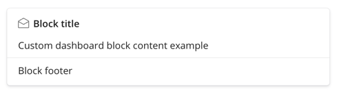
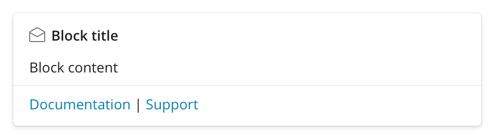
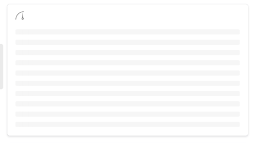
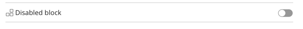
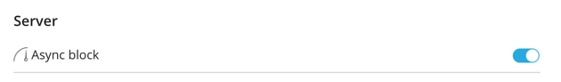
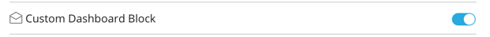
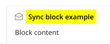

# Custom Dashboard Extension Example

This README explains how you can customize your extension's block on the administrator's Home page via a number of methods provided by the abstract `Block` class.


## Setup
```sh
git clone https://github.com/plesk/ext-home-screen-example
cd ext-home-screen-example/
composer install
```

## Packaging & Installation
```sh
zip -r ext-home-screen-example.zip ext-home-screen-example/ --exclude "ext-home-screen-example/.git/*"
plesk bin extension -i ext-home-screen-example.zip
```
## Customization Options

### 1. Block ID `getId()`

Defines the block's unique identifier.

**Example:**

```php
public function getId(): string {
    return 'example_block';
}
```

### 2. Block Title `getTitle()`

Defines the block's name (by default, it is the same as the extension's name). The name will be shown when customizing the Home page (inside the Customize drawer). It's always loaded synchronously and should be lightweight.

**Important:** The name is unescaped HTML. Make sure it's properly sanitized.

**Example:**

```php
public function getTitle(): string {
    return "Custom Dashboard Block";
}
```


### 3. Block Content `getContent()`

Defines the block's content that will be shown inside the block on the Home page.

**Important:** The content is unescaped HTML. Make sure that any dynamic data is properly escaped and sanitized to prevent security issues.

**Example:**

```php
public function getContent(): string {
    return "<div>Custom dashboard block content example</div>";
}
```


### 4. Block Footer `getFooter()`

Defines the content of the block's footer (by default, it's empty).

**Important:** The footer is unescaped HTML. Make sure that any dynamic data is properly escaped and sanitized to prevent security issues.

**Example:**

```php
public function getFooter(): string {
    return "
        <div class='footer-links'>
            <a href='/docs'>Documentation</a> | 
            <a href='/support'>Support</a>
        </div>
    ";
}
```


### 5. Block Column `getColumn()`

Defines which of the three columns on the Home page the block will be placed in.

- **0**: First column
- **1**: Second column
- **2**: Third column (the last column by default)

By default, the block will be placed in the last column (column `2`).

**Example:**

```php
public function getColumn(): int {
    return 1;
}
```

### 6. Block Order `getOrder()`

Defines the order in which the block will appear within the column it's placed in. The blocks are ordered depending on their respective `getOrder()` values. By default, the block will be placed last within its column.

You can customize this order by returning a specific integer value. The lower the value, the higher the block will be placed within its column, and vice versa.

**Example:**

```php
public function getOrder(): int {
    return 1;
}
```

### 7. Asynchronous Loading `isAsyncLoaded()`

Defines whether the content of the block may be loaded asynchronously (true by default). Asynchronous loading improves the Home page load time by allowing the block's content to be fetched in the background while the rest of the page is being rendered.

- **Synchronous Blocks** content is loaded during page preload (before rendering) to avoid the blinking caused by switching from a skeleton to the block's content. This blocks the page rendering, and should only be used for blocks that load very quickly.

- **Asynchronous Blocks** content is loaded after the page has been rendered. This doesn't block the page rendering. A skeleton is shown as a placeholder while the content is being loaded.
If the content loads very quickly, the transition from the skeleton to the block's content may cause blinking. In such cases, a synchronous block may be preferable.

- **Default behavior**: The block content is loaded asynchronously (true by default).

**Example:**

```php
public function isAsyncLoaded(): bool {
    return false;
}
```

### 8. Skeleton Size `getSkeletonSize()`

Defines the size of the skeleton (content placeholder) to be shown while the block’s content is being loaded. This option is only applicable when the block is set to load asynchronously. By default, the size of the skeleton is set to 2.

**Example:**

```php
public function getSkeletonSize(): int {
    return 10;
}
```


### 9. Block Enabled `isEnabled()`

Defines whether the block is to be shown on the Home page (true by default). Disabled blocks do not appear on the Home page.

- **Default behavior**: The block is enabled by default.

**Example:**

```php
public function isEnabled(): bool {
    return false;
}
```


### 10. Block Section `getSection()`

Defines the section the block belongs to, which determines where it will appear when customizing the Home page (inside the Customize drawer). You can place the block in one of the following sections:

- `SECTION_PLESK` – Default section for blocks (all blocks are placed in this section unless a different section is explicitly specified)
- `SECTION_SERVER` – For server-related blocks
- `SECTION_SECURITY` – For security-related blocks

**Example:**

```php
public function getSection(): string {
    return self::SECTION_SERVER;
}
```


### 11. Block Section Order `getSectionOrder()`

Defines the position of the block relative to other blocks in the same section when customizing the Home page (inside the Customize drawer). By default, the block is placed last.

You can control the sequence in which blocks appear within their respective section by returning a specific integer value. Blocks with a lower order value will be placed before those with a higher value.

**Example:**

```php
public function getSectionOrder(): int {
    return 1;
}
```

### 12. Block Name `getName()`

Defines the block's name shown when customizing the Home page (inside the Customize drawer). By default, it is the same as the extension's name.

**Example:**

```php
public function getName(): string {
    return 'Custom Dashboard Block'; 
}
```


### 13. Block Icon `getIcon()`

Specifies the icon to be shown alongside the block name when customizing the Home page.

**Example:**

```php
public function getIcon(): string {
    return 'mail';
}
```


### Declaring Multiple Dashboard Blocks

Extensions can expose multiple custom blocks that are declared via the `Plesk\SDK\Hook\Home` hook.

```php
namespace Plesk\SDK\Hook;

/**
 * Hook for embedding custom blocks into the Home page in SPV.
 *
 * @since 18.0.60
 */
use Plesk\SDK\Hook\Home;
use PleskExt\Example;

return new class () extends Home {
    /**
     * Retrieve blocks for the Home page in SPV.
     *
     * @return Home\Block[]
     */
    public function getBlocks(): array
    {
        return [
            new Example\HomeSyncBlock(),
            new Example\HomeAsyncBlock(),
        ];
    }
};
```